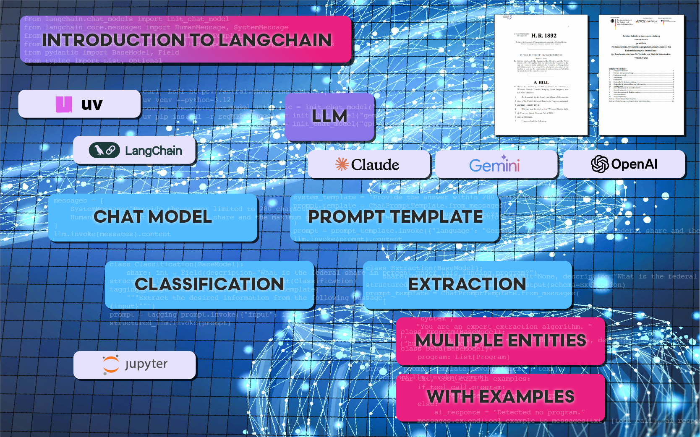
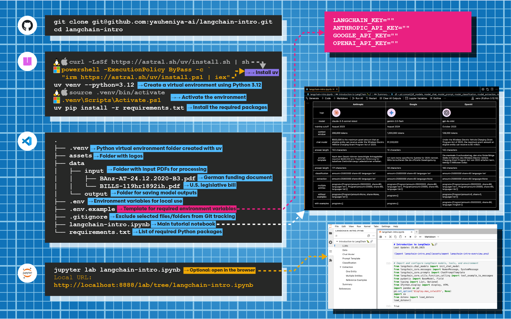

# Introduction to LangChain



This project demonstrates how to extract structured data from legal documents using LangChain, focusing on:

- Prompt templates for classification and information extraction
- Use of multiple LLMs (OpenAI, Anthropic, Google) for comparison
- Structured output with Pydantic models
- Reference examples for tool call validation

## Run

```bash
git clone git@github.com:yauheniya-ai/langchain-intro.git
cd langchain-intro
```
Optional: install `uv` — a new, ultra-fast Python package manager that installs packages much faster than `pip. 
```bash
curl -LsSf https://astral.sh/uv/install.sh | sh # macOS/Linux
powershell -ExecutionPolicy ByPass -c `
"irm https://astral.sh/uv/install.ps1 | iex" # Windows (Powershell)
```
Create and activate a virtual environment:
```bash
uv venv --python=3.12
source .venv/bin/activate # macOS/Linux
.venv\Scripts\Activate.ps1 # Windows (Powershell)
```
Then install all dependencies:
```bash
uv pip install -r requirements.txt
```

Explore the notebook by opening `langchain-intro.ipynb` — either directly in your IDE or by running `jupyter lab langchain-intro.ipynb` to open it in a browser.



Happy coding!

## Next steps
Future tutorials will explore embeddings, vector databases, and semantic search.